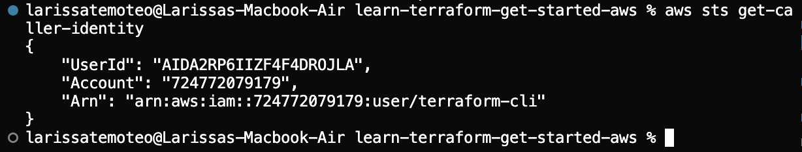
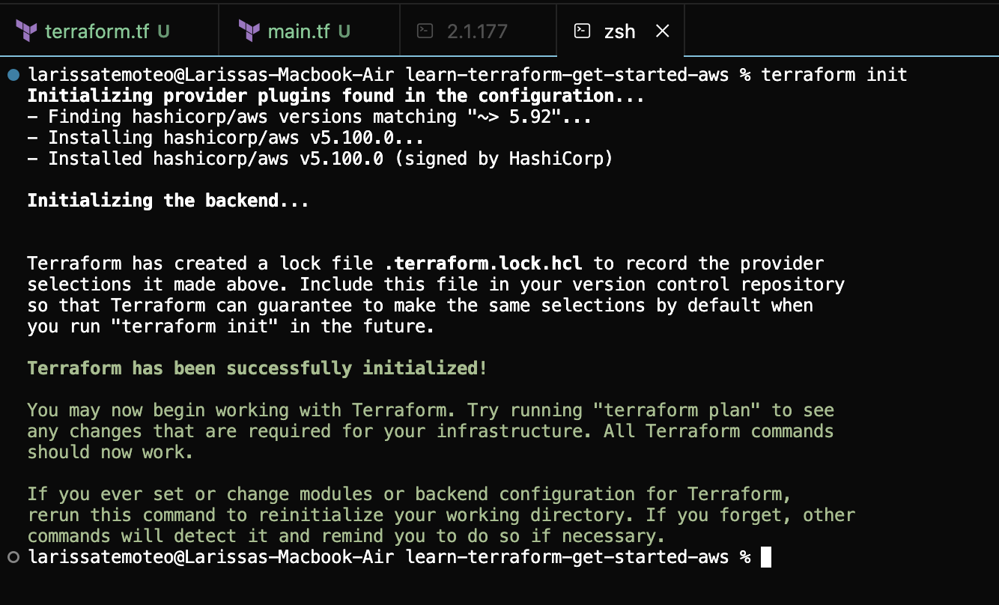
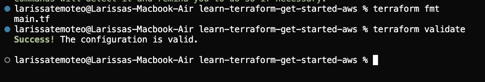
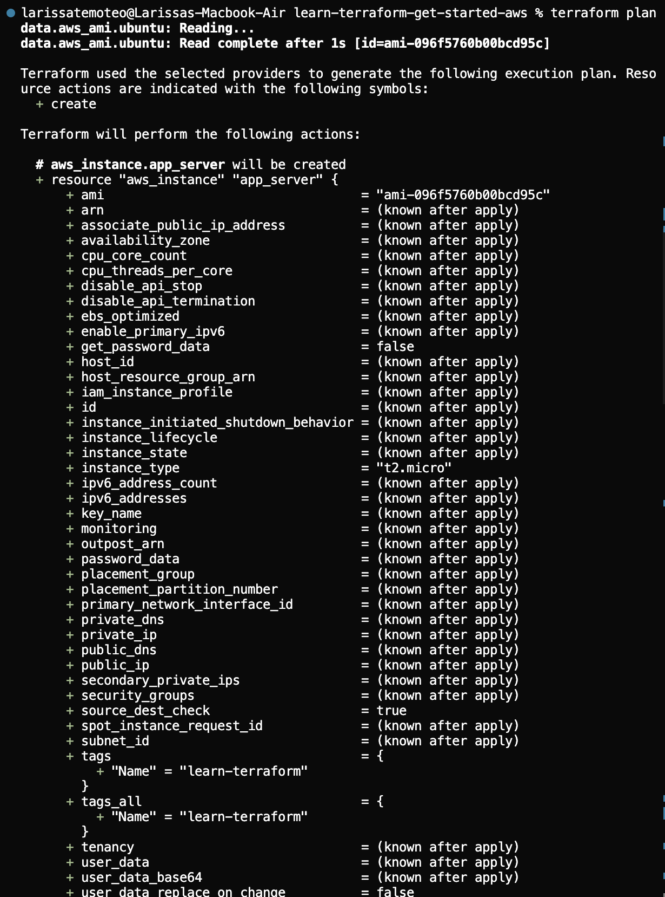
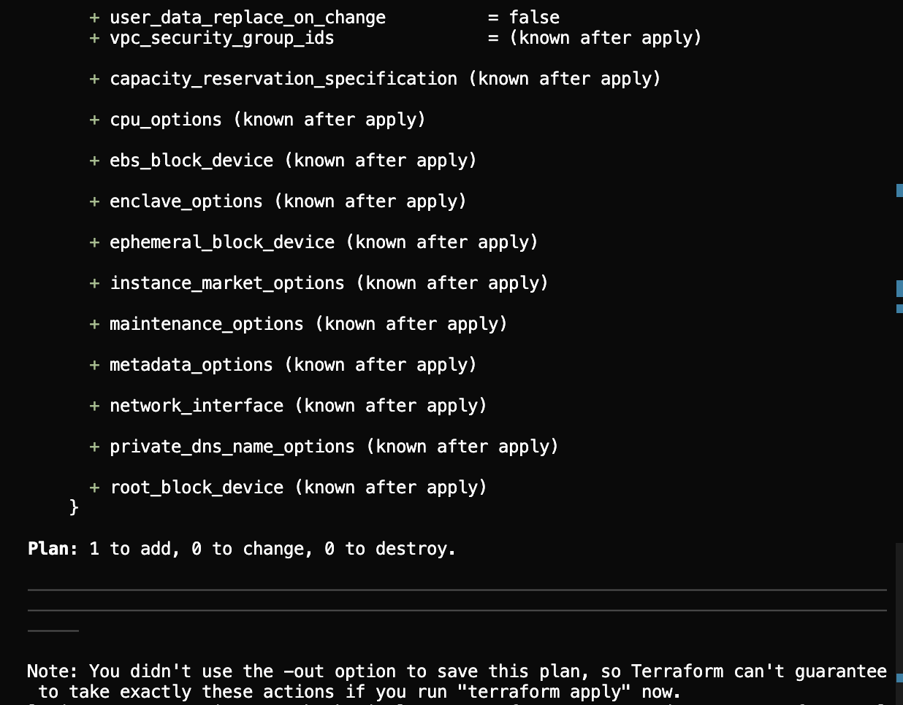
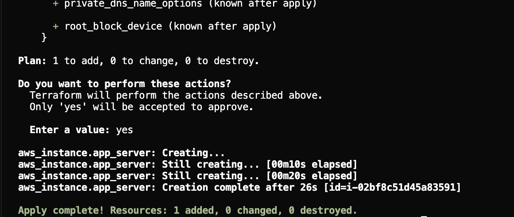
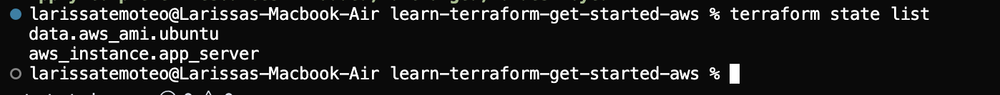
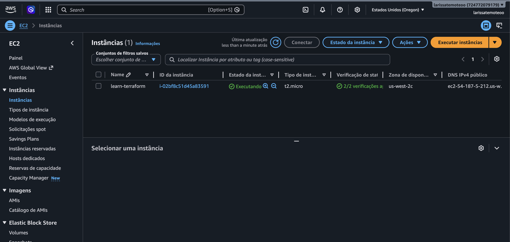
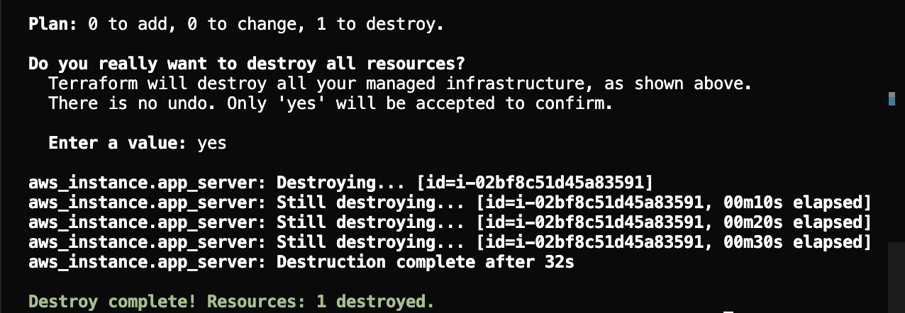

# 🛠️ Terraform AWS — Get Started (Infraestrutura como Código)

Infraestrutura como Código (IaC) permite descrever e versionarizar toda a sua infraestrutura em nuvem como código — reproduzível, auditável e colaborativo. Este projeto implementa o tutorial oficial da HashiCorp para provisionar uma instância EC2 na AWS via Terraform, demonstrando os fundamentos de IaC de forma prática e versionada.

## 📋 Pré-requisitos

- **Conta AWS** com privilégios de criar instâncias EC2
- **Usuário IAM** com access key ID e secret access key (nunca usar credenciais root)
- **Terraform** >= 1.2 (versão neste projeto: 1.15.6)
- **AWS CLI** v2 (versão neste projeto: 2.35.4)
- **Região configurada:** `us-west-2`
- **Instância de teste:** t2.micro elegível ao free-tier, exceto por custos de transferência de dados

## 📁 Estrutura dos arquivos

O projeto contém dois arquivos Terraform que definem a infraestrutura:

### `terraform.tf`
Define os requisitos do Terraform (versão mínima e provider):

```hcl
terraform {
  required_providers {
    aws = {
      source  = "hashicorp/aws"
      version = "~> 5.92"
    }
  }

  required_version = ">= 1.2"
}
```

Este bloco garante que:
- O provider AWS versão 5.92 ou compatível seja utilizado
- O Terraform 1.2 ou superior seja exigido para rodar o projeto

### `main.tf`
Define o provider, fonte de dados e o recurso da instância EC2:

```hcl
provider "aws" {
  region = "us-west-2"
}

data "aws_ami" "ubuntu" {
  most_recent = true

  filter {
    name   = "name"
    values = ["ubuntu/images/hvm-ssd-gp3/ubuntu-noble-24.04-amd64-server-*"]
  }

  owners = ["099720109477"] # Canonical
}

resource "aws_instance" "app_server" {
  ami           = data.aws_ami.ubuntu.id
  instance_type = "t2.micro"

  tags = {
    Name = "learn-terraform"
  }
}
```

Este arquivo:
- Configura a região AWS como `us-west-2`
- Define uma **data source** que busca a AMI mais recente do Ubuntu 24.04 LTS (Noble) da Canonical
- Cria uma **instância EC2** (`app_server`) do tipo `t2.micro` com a AMI encontrada, etiquetada como `learn-terraform`

## 🚀 Passo a passo

### 1. Configurar o AWS CLI

**Propósito:** Autenticar com a AWS usando suas credenciais IAM, permitindo que o Terraform acesse sua conta.

**Comando:**
```bash
aws configure
```

Ao executar, você será solicitado a informar:
- AWS Access Key ID
- AWS Secret Access Key
- Region padrão: `us-west-2`
- Formato de saída: `json` (ou pressione Enter para padrão)

**Verificação:**
```bash
aws sts get-caller-identity
```

**Saída esperada:**
```json
{
    "UserId": "AIDACKCEVSQ6C2EXAMPLE",
    "Account": "123456789012",
    "Arn": "arn:aws:iam::123456789012:user/terraform-user"
}
```



### 2. terraform init

**Propósito:** Inicializar o diretório de trabalho, baixar o provider AWS e preparar o ambiente.

**Comando:**
```bash
terraform init
```

**Saída esperada:**
```
Initializing the backend...
Initializing provider plugins...
- Finding hashicorp/aws versions matching "~> 5.92"...
- Installing hashicorp/aws v5.100.0...
- Installed hashicorp/aws v5.100.0 (signed by HashiCorp)

Terraform has created a lock file .terraform.lock.hcl to record the provider
selections it made above.

Terraform has been successfully initialized!
```



### 3. terraform fmt + terraform validate

**Propósito:** Formatar o código Terraform para padrão HCL e validar a sintaxe.

**Comando:**
```bash
terraform fmt -recursive
terraform validate
```

**Saída esperada:**
```
Success! The configuration is valid.
```



### 4. terraform plan

**Propósito:** Gerar um plano de execução mostrando quais recursos serão criados, modificados ou destruídos.

**Comando:**
```bash
terraform plan
```

**Saída esperada:**
```
Terraform will perform the following actions:

  # aws_instance.app_server will be created
  + resource "aws_instance" "app_server" {
      + ami                    = "ami-096f5760b00bcd95c"
      + availability_zone      = (known after apply)
      + instance_type          = "t2.micro"
      + tags                   = {
          + "Name" = "learn-terraform"
        }
      ...
    }

Plan: 1 to add, 0 to change, 0 to destroy.
```

Atributos do recurso a ser criado:


Resumo do plano (`Plan: 1 to add, 0 to change, 0 to destroy.`):


### 5. terraform apply

**Propósito:** Aplicar o plano e criar a infraestrutura na AWS.

**Comando:**
```bash
terraform apply
```

Quando solicitado, digite `yes` para confirmar:

**Saída esperada:**
```
aws_instance.app_server: Creating...
aws_instance.app_server: Still creating... [10s elapsed]
aws_instance.app_server: Creation complete after 15s [id=i-02bf8c51d45a83591]

Apply complete! Resources: 1 added, 0 changed, 0 destroyed.
```



**Estado salvo:**
```bash
terraform state list
```

Saída:
```
data.aws_ami.ubuntu
aws_instance.app_server
```



## 🧠 Entendendo o `terraform plan`

O `terraform plan` mostra o que será executado. Alguns conceitos-chave:

- **Data source vs. Resource:** A `data.aws_ami.ubuntu` é um **data source** — consulta apenas informações existentes (a AMI). A `aws_instance.app_server` é um **resource** — será criada do zero.
- **AMI lida primeiro:** O Terraform lê a data source antes de criar a instância para descobrir qual AMI usar.
- **"Plan: 1 to add":** Significa que 1 recurso será criado (a instância). Data sources não contam.
- **Símbolos:**
  - `+` = recurso será criado
  - `~` = recurso será modificado
  - `-` = recurso será destruído
- **"known after apply":** Alguns atributos (como IP público, ID da instância) só são conhecidos após a criação.
- **Recursos implícitos:** Mesmo sem especificar VPC, subnet ou security group, a AWS fornece padrões (VPC padrão, subnet padrão, security group padrão) automaticamente.

## ☁️ Itens provisionados na nuvem

Neste tutorial, o Terraform provisionou **apenas 1 recurso real** na AWS: uma instância EC2 (`aws_instance.app_server`). O outro item que aparece no `terraform state list` é a AMI (`data.aws_ami.ubuntu`), que é um **data source** — ou seja, foi apenas **consultado** para descobrir qual imagem usar, e **não** é um recurso criado nem cobrado.

```
$ terraform state list
data.aws_ami.ubuntu      # data source (somente leitura — NÃO é recurso criado)
aws_instance.app_server  # recurso de fato criado na AWS
```

### Instância EC2 criada

| Atributo | Valor |
| --- | --- |
| Instance ID | `i-02bf8c51d45a83591` |
| Estado | `running` |
| Tipo | `t2.micro` (1 vCPU, 1 GiB RAM, elegível ao free-tier) |
| AMI | `ami-096f5760b00bcd95c` (Ubuntu Server 24.04 LTS "Noble", Canonical) |
| Região / AZ | `us-west-2` / `us-west-2c` |
| IP público | `54.187.5.212` |
| DNS público | `ec2-54-187-5-212.us-west-2.compute.amazonaws.com` |
| IP privado | `172.31.14.142` |
| Subnet | `subnet-03f088a2f97741c81` (default VPC) |
| ARN | `arn:aws:ec2:us-west-2:724772079179:instance/i-02bf8c51d45a83591` |
| Tag | `Name = learn-terraform` |

> ⚠️ Os valores de **Instance ID** e **IPs** são **efêmeros**: eles existem apenas enquanto a instância estiver de pé e mudarão (ou desaparecerão) quando ela for destruída ou recriada.

### Recursos implícitos (não escritos no `.tf`)

Mesmo sem nenhuma configuração de rede no código, a instância foi colocada na infraestrutura padrão da conta:

- **VPC padrão (default VPC):** toda conta AWS já vem com uma VPC criada automaticamente em cada região; a instância foi associada a ela por padrão.
- **Subnet padrão (`us-west-2c`):** dentro da VPC padrão existe uma subnet por zona de disponibilidade; a instância caiu na subnet `subnet-03f088a2f97741c81`, na AZ `us-west-2c`.
- **Security group padrão (default):** como nenhum grupo de segurança foi especificado, a AWS aplicou o security group `default` da VPC.

Esses itens aparecem associados à instância porque a AWS preenche automaticamente rede, subnet e security group quando não os informamos — por isso não estão no `.tf`, mas existem na nuvem.

### Evidências

Execução do `terraform apply`:


Saída do `terraform state list` (recurso + data source):


Instância em execução no Console EC2 da AWS:


### Observação final

Todo esse estado — IDs, IPs, atributos e o vínculo com os recursos implícitos — é registrado no arquivo `terraform.tfstate`. Esse arquivo está no `.gitignore`, pois pode conter dados sensíveis e **não deve ser versionado**. Ao rodar `terraform destroy`, a instância EC2 é removida da AWS e o estado é atualizado, deixando de existir cobrança e recursos provisionados.

## 🧹 Como destruir a infraestrutura

**Propósito:** Remover todos os recursos provisionados da AWS para evitar cobranças contínuas.

**Comando:**
```bash
terraform destroy
```

Quando solicitado, digite `yes` para confirmar:

**Saída esperada:**
```
aws_instance.app_server: Destroying... [id=i-02bf8c51d45a83591]
aws_instance.app_server: Still destroying... [10s elapsed]
aws_instance.app_server: Destruction complete after 18s

Destroy complete! Resources: 1 destroyed.
```



> ⚠️ **Atenção:** Mesmo instâncias t2.micro elegíveis ao free-tier podem gerar custos com transferência de dados ou por estar fora do período free-tier. Sempre destrua recursos quando não estiver usando.

## 📚 Referências

- [HashiCorp Terraform AWS Get Started Tutorial](https://developer.hashicorp.com/terraform/tutorials/aws-get-started/aws-create)
- [Terraform AWS Provider Documentation](https://registry.terraform.io/providers/hashicorp/aws/latest/docs)
- [Terraform Language Documentation](https://developer.hashicorp.com/terraform/docs)
